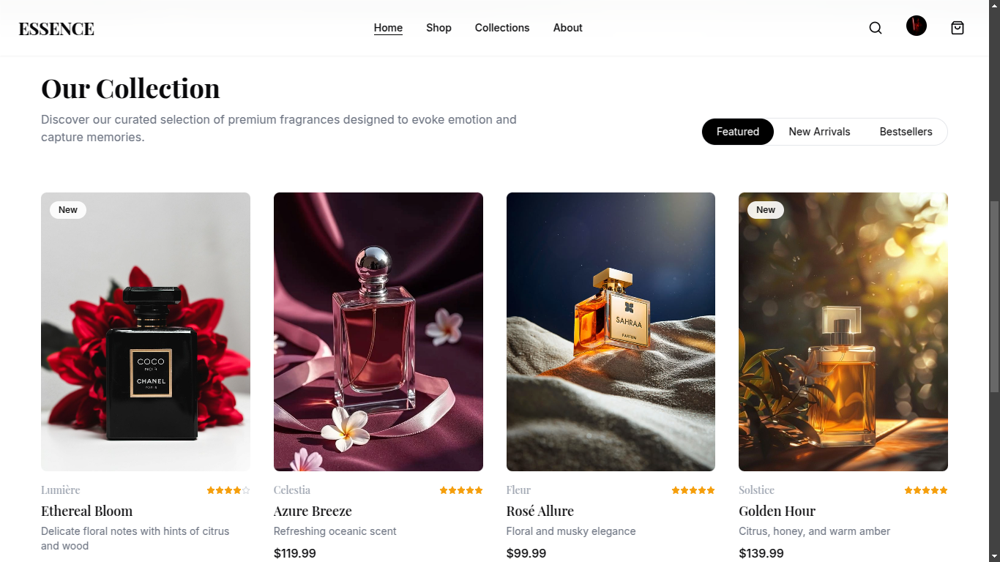
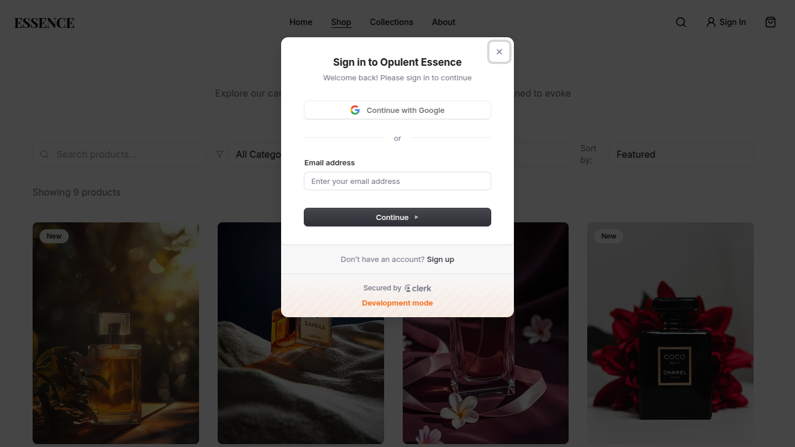
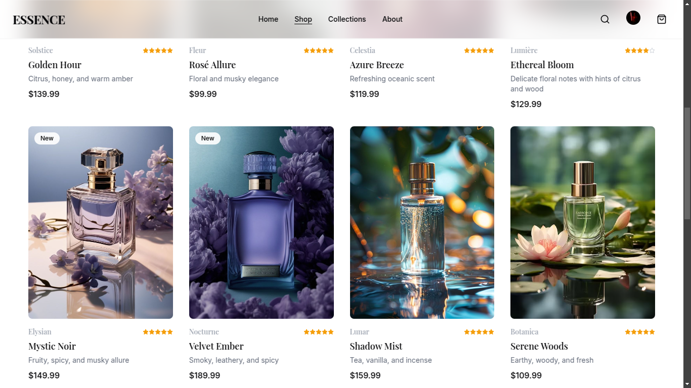
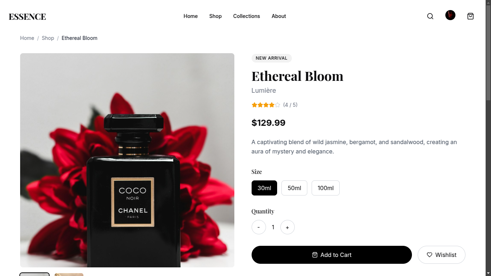
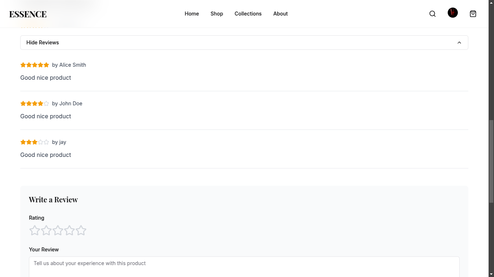
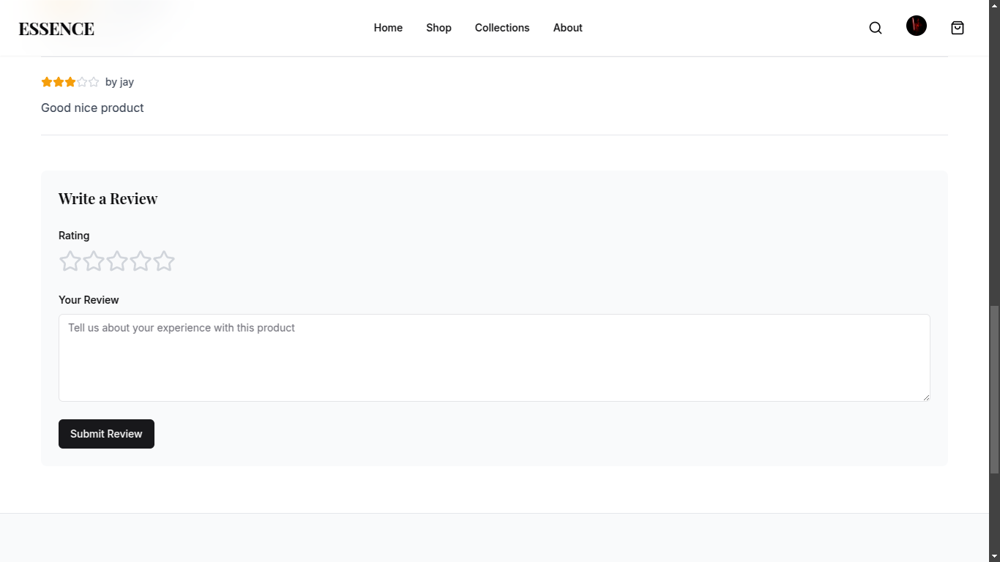
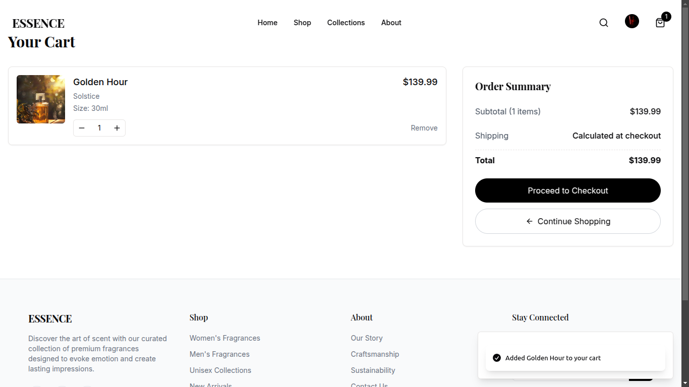
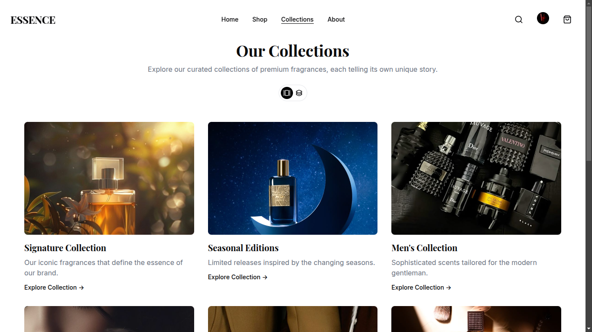
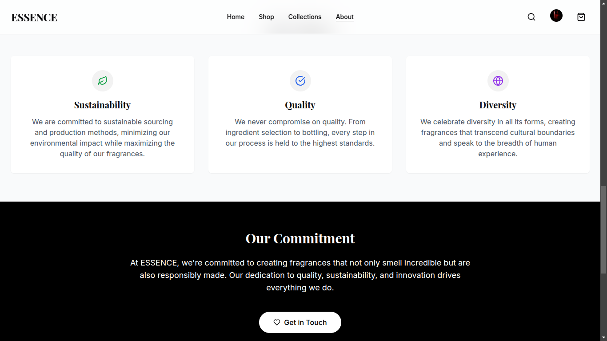

# Perfume Shop - Full Stack Web Application

An elegant and interactive perfume e-commerce platform built using **React (Vite), Tailwind CSS, Node.js, MongoDB, and Clerk authentication**. This project delivers a seamless shopping experience with **user authentication, product filtering, and a fully functional cart**.

## 🚀 Live Demo

[Click Here](https://perfume-frontend1.vercel.app/)

---

## 📌 Features

### 🔹 Frontend (React + Tailwind CSS)

- **Responsive Navigation Bar** – Smooth and intuitive navigation across pages.
- **Hero Banner** – Eye-catching call-to-action section for promotions and offers.
- **Product Cards** – Displaying perfumes with images, descriptions, and prices.
- **Hover Effects** – Interactive animations for a better user experience.
- **Product Redirection** – Clicking a product opens a detailed page.
- **Filters & Collections** – Filter perfumes by price, category, and brand.
- **Cart System** – Add/remove products from the shopping cart.
- **About Us Page** – Showcasing brand information.
- **User Authentication (Clerk)** – Secure login and signup functionality.

### 🔹 Backend (Node.js + MongoDB)

- **Dynamic Product Management** – Fetching product details from MongoDB.
- **Review System** – Users can read and submit reviews for perfumes.
- **Image Gallery** – Multiple images per product.
- **Social Sharing** – Share product details via social media.
- **User Authentication (Clerk)** – Secure login/logout functionality.

🔗 **Backend Repository:** [GitHub Link](https://github.com/saijayanth59/perfume_frontend) (Replace with actual link)

---

## 🛠️ Tech Stack

- **Frontend:** React (Vite), Tailwind CSS
- **Backend:** Node.js, Express.js, MongoDB
- **Authentication:** Clerk
- **Database:** MongoDB
- **Deployment:** Vercel (Frontend), Render/Heroku (Backend)

---

## ⚙️ Setup & Installation

### 1️⃣ Clone the Repository

```sh
git clone https://github.com/yourusername/perfume-shop.git
cd perfume-shop
```

### 2️⃣ Setup Frontend

```sh
npm install
```

Create a `.env` file in the `client` directory and add:

```sh
VITE_API_URL=http://localhost:3001/api/products
```

Start the frontend server:

```sh
npm run dev
```

---

## 📷 Screenshots

### 🏠 Home Page




### 🔐 Authentication



### 🛍️ Products Listing




### 🔎 Product Details



### ⭐ Reviews Section




### 🛒 Shopping Cart



### 📂 Collections



### ℹ️ About Us




---

## 🛠️ Upcoming Features

- Payment Integration
- Wishlist Feature
- Order History
- Admin Dashboard for Product Management

---

## 💡 Connect

For any queries, reach out at [keshavaradha990@gmail.com](mailto:keshavaradha990@gmail.com)
